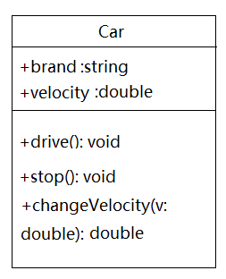

# 类图
- 基本表示方式  
在UML类图中，每一个矩形代表一个类。我们举一个简单的例子：  
  
这是一个代表车辆的类。 
一般的类图分为三个部分。部分类图有五个部分。   
第一部分为类名  
如果类名用正体书写则说明这是可以实例化的普通类。  
如果类名用斜体书写，则说明这是抽象类。  
如果类名有下划线修饰则说明这是静态类。  
第二部分为类内的属性  
格式为修饰符 属性名 ：属性类型。  
修饰符为“+”说明该属性为public型，“#”说明该属性为protected型，“-”说明该属性为private型。  
第三部分为类内的方法  
格式为修饰符 方法名 （参数名1：参数类型1，……）：方法返回值类型。  
修饰符为“+”说明该方法为public型，“#”说明该方法为protected型，“-”说明该方法为private型。  
如果方法名有下划线修饰则说明这是静态方法。  
如果类图中需要描述类的性质，则放在第四部分描述。如果类内有内部类，则放在第五部分描述。  
如果类图描述的是一个接口，在接口名的上方需要加上《interface》的修饰符。同时该类图仅有两个部分，接口名和接口的方法。  

- 关系的表示方式
1. 继承关系使用如下箭头, 由子类指向父类。  

2. 实现关系使用如下箭头, 由实现类指向接口。

3. 依赖关系使用如下箭头, 由使用者指向被使用者。  
  
如果A指向B，则说明A中使用了B，使用方式包括：  
A类中有B类实例化对象的局部变量。  
A类中有方法把B类实例化对象当做了参数，  
A类中有方法调用了B类中的静态方法。
4. 关联关系使用如下箭头, 由拥有者指向被拥有者。    

如果A指向B，则说明A类中有B类的成员变量。  
5. 聚合关系使用如下箭头, 由整体指向部分。
  
如果A指向B，则说明A类中有B类的成员变量，但是与关联关系不同，A类和B类有逻辑关系。  
A类是整体，B类是部分。A类由B类构成，同时B类即便不在A类中也可以单独存在。
6. 组合关系使用如下箭头, 由整体指向部分。

如果A指向B，则说明A类中有B类的成员变量，但是与关联关系不同，A类和B类有逻辑关系。  
A类是整体，B类是部分。A类由B类构成。但与聚合关系不同，如果B类不在A类中就无法单独存在。